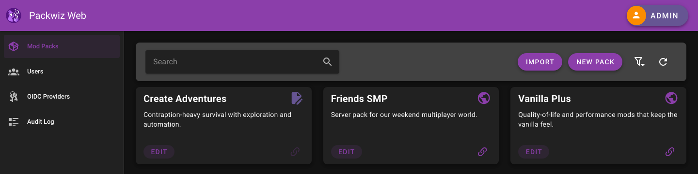
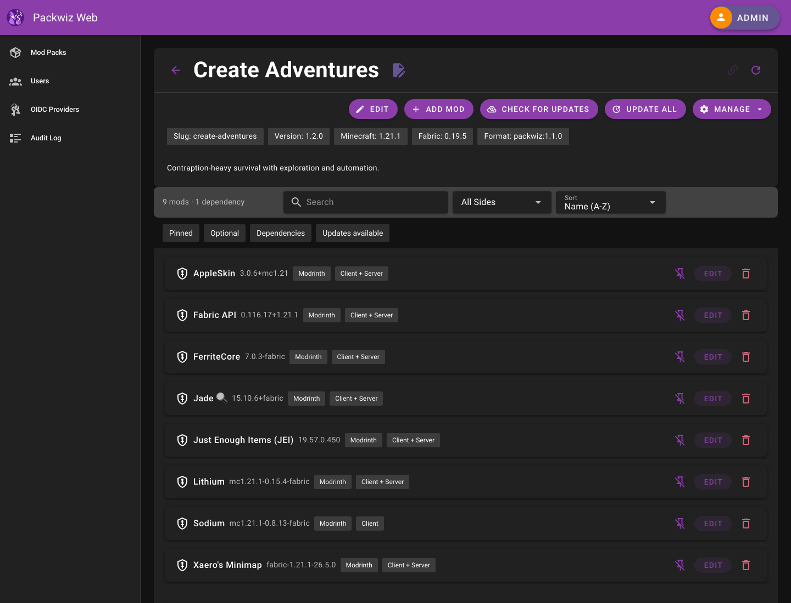

# Packwiz Web UI

> This code was developed with assistance from LLM AI coding agents.

[](LICENSE)

> [!NOTE]
>
> **This project is in beta**
> Some features may have bugs

A web service to manage [Packwiz](https://github.com/packwiz/packwiz) Minecraft Mod configurations.
This uses a fork of Packwiz, [packwiz-nxt](https://github.com/leocov-dev/packwiz-nxt) that exposes more functionality as a library.

Create packs, add and update mods, and serve the result to servers and clients.

| Feature           | Description                                                              |
|-------------------|--------------------------------------------------------------------------|
| Pack management   | Create, edit and update packs and mods in an interactive web UI          |
| Accounts          | Admin and user accounts with permission-based roles and pack collaborators |
| OIDC login        | Sign in with Keycloak, Authentik, Google and others                      |
| Static pack files | Serve public or token-protected packs to servers and clients             |
| Public pack page  | Shareable page for each public pack                                      |
| Snapshots         | Automatic pack history with revert and clone                             |
| Duplicate         | Clone a pack to test out changes                                         |
| Import            | Import a packwiz pack from a `pack.toml` URL or existing configuration   |
| Export            | MultiMC / Prism instance export                                          |
| Audit log         | All API actions logged, plus `pack.toml` access metrics                  |





## Deploy
This is a web service intended to be deployed as a docker container.
A Postgres database is required. 
See the deployment examples in [examples](examples):
- [docker-compose.yml](examples/docker-compose/docker-compose.yml): Basic single-container setup running background jobs in-process (`--worker`).
- [docker-compose-worker](examples/docker-compose-worker/docker-compose.yml): Multi-container setup running a dedicated worker container with in-process jobs disabled on the web container.

[Latest Container Image](https://github.com/leocov-dev/packwiz-web/pkgs/container/packwiz-web)

### Environment Variables

Variables can also be set in a `.env` file in the working directory or next to the executable.

| var                      | default      | description                                                                                                                                           |
|--------------------------|--------------|-------------------------------------------------------------------------------------------------------------------------------------------------------|
| PWW_MODE                 | `production` | `production` or `development`. `development` adds logging, do NOT deploy with it.                                                                     |
| PWW_ADMIN_PASSWORD       | random       | Password for the default `admin` account, applied on every start. You must set this, a random value is used otherwise so you cannot log in.         |
| PWW_SESSION_SECRET       | insecure     | Encryption key for the HTTP session, set a long random string. OIDC login will not work with the default.                                            |
| PWW_PUBLIC_URL           | none         | External URL of the app, e.g. `https://packwiz.example.com`. Required for OIDC login. See [OIDC login](docs/oidc.md).                                |
| PWW_TRUSTED_PROXIES      | none         | Comma separated reverse proxy IPs or CIDRs, so audit logs show real client IPs. See [reverse proxy](docs/reverse-proxy.md).                          |
| PWW_AUDIT_RETENTION_DAYS | `90`         | Audit log rows older than this many days are deleted daily by the worker. `0` keeps them forever.                                                     |
| PWW_JOB_WORKER_POOL_SIZE | `10`         | Number of background jobs the worker runs at once.                                                                                                    |
| PWW_CF_API_KEY           | none         | base64 encoded Curseforge API key, required to add Curseforge mods. The pre-built container images already include one.                              |
| PWW_GH_API_KEY           | none         | GitHub API key, to avoid rate limits or download from private repositories.                                                                           |

Postgres connection vars:

| var             | default    | description                                       |
|-----------------|------------|---------------------------------------------------|
| PWW_PG_HOST     | `localhost`| database host, url or ip addr                     |
| PWW_PG_PORT     | `5432`     | database connection port                          |
| PWW_PG_USER     | `postgres` | database connection username                      |
| PWW_PG_PASSWORD | none       | database connection password                      |
| PWW_PG_DBNAME   | `packwiz`  | database name to use, should already exist        |


### User Access

Users access mods at the static file endpoint:
- if the pack is public:
  - `https://<host>/packwiz/public/<pack-name>/pack.toml`
  - this url may be shared with anyone
- if the pack is not public:
  - `https://<host>/packwiz/<user-token>/<pack-name>/pack.toml`
  - this url is not intended to be shared
  - user access is logged 
  - the token can be regenerated

### Security

By default, admins may create user accounts with passwords managed by the service.

Users can also sign in with OpenID Connect providers such as Keycloak, Authentik or Google.
Admins add and manage the providers in the web UI, and local password login always stays available.
See [OIDC login](docs/oidc.md) for setup.

#### Audit Logs

All API actions are logged in an audit log table.
Behind a reverse proxy, see [reverse proxy](docs/reverse-proxy.md) to record real client IPs.

---

## Develop

### Requirements
 - Go (version specified in backend/go.mod)
 - Node (version specified in frontend/package.json)

```shell
# Build the frontend and backend with:
make build-all

# Run in development mode (Docker must be installed and running)
make start-dev
```

`make start-dev` automatically starts a local Postgres via Docker (see
[localdev](localdev)) and runs the backend and frontend in development mode.
Run `make dev-db-down` to stop the local database when you're done.

Once running, open http://localhost:3000 and sign in with the default admin account:

| field    | value                            |
|----------|----------------------------------|
| username | `admin`                          |
| password | `insecure-admin-pass-change-me`  |

These are local-only dev values, set in the `DEV_ENV` block of the [Makefile](Makefile).

See readme files for [frontend](frontend/README.md) and [backend](backend/README.md) for specific details about each.

The [examples](examples) directory contains some examples for local deployments.

### Container
The frontend and backend can be built into a container image for deployment.

```shell
# build and run the container locally
make build-image
docker run packwiz-web
```
